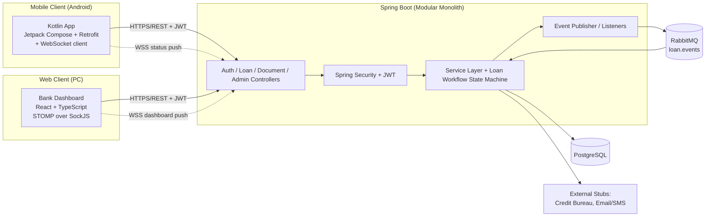
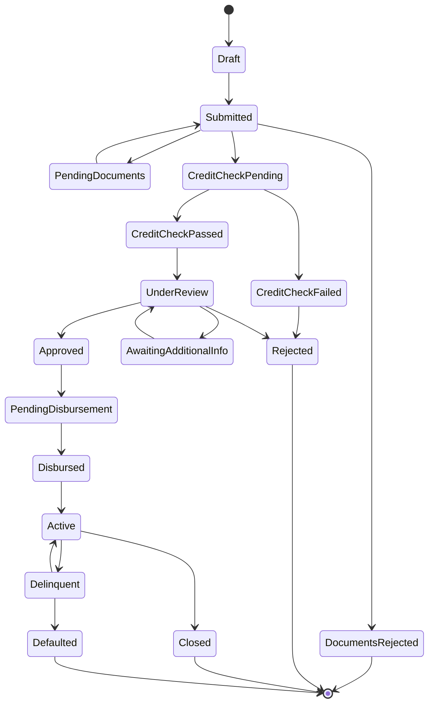

# Bank Loan Application System — Project Plan & Architecture

**Course:** Client Server Programming for Applications
**Assignment:** Project Concept / Class Activity (semester-long group task)
**Group members:**

| # | Name | Reg. Number |
|---|------|--------------|
| 1 | Murungi Kevin Tumaini | 2023/BSE/094/PS |
| 2 | Ainamaani Allan Mwesigye | 2023/BSE/151/PS |
| 3 | Mbabazi Patience | 2023/BSE/079/PS |
| 4 | Arinda Jordan | 2023/BSE/024/PS |
| 5 | Arimu Mariam | 2023/BSE/021/PS |
| 6 | Mwunvaneeza Godfrey | 2023/BSE/100/PS |
| 7 | Kihagama Ismael | 2023/BSE/065/PS |
| 8 | Ochwo Denis | 2023/BSE/164/PS |

> This is a **living working document** (as required by the class activity brief) — it guides the group through the semester and should be updated as decisions change. Detailed diagrams referenced below live in [`../diagrams/`](../diagrams/) as PlantUML sources + rendered PNGs; this document summarizes them and adds what's new today (roles/use-cases, dashboard IA, mobile screens, and the Task 1 scope).

---

## Table of Contents

1. [Problem Statement](#1-problem-statement)
2. [Actors & Roles](#2-actors--roles)
3. [High-Level Architecture](#3-high-level-architecture)
4. [Data Model (ERD Summary)](#4-data-model-erd-summary)
5. [Loan Workflow (State Machine)](#5-loan-workflow-state-machine)
6. [Use Cases](#6-use-cases)
7. [Web Dashboard — Information Architecture](#7-web-dashboard--information-architecture)
8. [Web Pages / Routes](#8-web-pages--routes)
9. [Mobile App — Screens](#9-mobile-app--screens)
10. [Client-Side Validation Rules](#10-client-side-validation-rules)
11. [Task 1 Scope — Frontend + Client-Side Validation](#11-task-1-scope--frontend--client-side-validation)
12. [Roadmap / Phases](#12-roadmap--phases)
13. [Suggested Team Split](#13-suggested-team-split)
14. [Repo / Folder Structure](#14-repo--folder-structure)
15. [Non-Functional Notes](#15-non-functional-notes)
16. [Decisions Log](#16-decisions-log)

---

## 1. Problem Statement

The Bank Loan Application System mimics a bank's loan process end to end:

- An **applicant** submits and tracks a loan application from a **mobile app**.
- **Bank staff** review, verify, and approve/reject applications from a **web dashboard** on their PCs.
- A shared **backend API** serves both clients and persists everything in a **relational database**.

| Component | User | Technology |
|---|---|---|
| Mobile Client | Applicant / Borrower | Kotlin (Android, Jetpack Compose) |
| Web Client | Bank Staff | React + TypeScript |
| Backend / API | — | Java (Spring Boot) |
| Database | Storage | PostgreSQL |

---

## 2. Actors & Roles

Per the existing ERD (`users.role`), five roles exist. For now **all staff share one login-gated dashboard shell**; role-based filtering/permissions is a later phase (see [§12](#12-roadmap--phases)), not Task 1.

| Role (enum) | Who | Core responsibility |
|---|---|---|
| `BORROWER` | Applicant (mobile) | Applies for loans, uploads documents, tracks status |
| `LOAN_OFFICER` | Staff (web) | First-line review of new applications, requests missing info |
| `CREDIT_ANALYST` | Staff (web) | Verifies documents, records credit assessment |
| `BRANCH_MANAGER` | Staff (web) | Final approve/reject decision, adjusts terms |
| `ADMIN` | Staff (web) | Manages staff accounts, loan products, audit log |

---

## 3. High-Level Architecture

Full detail: [`../diagrams/architecture.puml`](../diagrams/architecture.puml) / `.png`. Simplified view:



**Key decisions already made** (see `architecture.puml` for the authoritative version):
- Spring Boot as a **modular monolith** (not microservices) — simpler to build/grade in a semester.
- **RabbitMQ** decouples submission from async credit-check/notification processing.
- **WebSocket (STOMP/SockJS)** pushes live status updates to both clients.
- **Spring Statemachine** enforces the loan status transitions (§5).
- Credit bureau + email/SMS gateway are **stubbed/mocked** — this is coursework, not a real bank integration.

This backend/async complexity is **out of scope for Task 1** — Task 1 only builds the two frontends against mock data (see §11).

---

## 4. Data Model (ERD Summary)

Full detail: [`../diagrams/erd.puml`](../diagrams/erd.puml) / `.png`. Tables (all PostgreSQL, UUID PKs):

| Table | Purpose |
|---|---|
| `users` | Login identity + role for every actor (borrower or staff) |
| `applicant_profiles` | KYC data: national ID, DOB, employment, income, address |
| `loan_applications` | The application itself: amount, term, purpose, status |
| `documents` | Uploaded files per application + verification status |
| `credit_checks` | Result of the (stubbed) credit bureau check |
| `approvals` | Staff decision + comments per application |
| `disbursements` | Funds-release record once approved |
| `repayment_schedules` / `repayments` | Installments and actual payments (later phase) |
| `notifications` | In-app/email/SMS messages sent to a user |
| `audit_logs` | Who did what, when — for Admin's audit trail |

Task 1's mock data fixtures (web and mobile) should mirror these field names/types exactly, so swapping mock data for a real API call in Phase 2 is a data-layer change, not a UI rewrite.

---

## 5. Loan Workflow (State Machine)

Full detail: [`../diagrams/loan-workflow-state.puml`](../diagrams/loan-workflow-state.puml) / `.png`.



The web dashboard's per-role queues (§7) are essentially **filtered views over this status field** — e.g. Loan Officer sees `Submitted`/`AwaitingAdditionalInfo`, Credit Analyst sees `CreditCheckPending`/`PendingDocuments`, Branch Manager sees `UnderReview`.

---

## 6. Use Cases

### 6.1 Applicant (Mobile)

| ID | Use case |
|---|---|
| UC-A1 | Register / log in |
| UC-A2 | Complete/edit KYC profile (ID, DOB, employment, income, address) |
| UC-A3 | Browse available loan products |
| UC-A4 | Apply for a loan (amount, term, purpose) |
| UC-A5 | Upload supporting documents |
| UC-A6 | Track application status on a timeline (real-time push, later phase) |
| UC-A7 | Respond to a staff request for additional info/documents |
| UC-A8 | View notifications |
| UC-A9 | View repayment schedule (later phase, once `Active`) |
| UC-A10 | Manage profile / log out |

### 6.2 Loan Officer (Web)

| ID | Use case |
|---|---|
| UC-L1 | View new/assigned applications queue |
| UC-L2 | Review applicant details & documents |
| UC-L3 | Request additional info/documents from applicant |
| UC-L4 | Forward application for credit check |
| UC-L5 | View officer overview & stats (queue size, avg turnaround, trend) |

### 6.3 Credit Analyst (Web)

| ID | Use case |
|---|---|
| UC-C1 | View pending-verification / credit-check queue |
| UC-C2 | Verify uploaded documents (mark valid/invalid) |
| UC-C3 | View/record credit check result |
| UC-C4 | Recommend approve/reject with remarks |
| UC-C5 | View analyst overview & stats (verified vs pending, pass rate) |

### 6.4 Branch Manager (Web)

| ID | Use case |
|---|---|
| UC-M1 | View applications pending final approval |
| UC-M2 | Approve / reject, optionally adjusting amount/tenure/interest |
| UC-M3 | View approved / rejected / disbursed history |
| UC-M4 | View manager overview & stats (approval rate, amount disbursed, monthly trend) |

### 6.5 Admin (Web)

| ID | Use case |
|---|---|
| UC-D1 | Manage staff accounts & role assignment |
| UC-D2 | Manage loan products (create/edit min-max amount, term, rate) |
| UC-D3 | View audit log |
| UC-D4 | View system-wide overview & stats (all branches/roles combined) |

---

## 7. Web Dashboard — Information Architecture

**Decision:** one shared dashboard shell, **one sidebar showing every staff domain**, regardless of who's logged in. Each domain is a collapsible **parent button**; the operations under it are **child buttons**. Every domain's first child is always an **Overview** page — charts + KPI stat cards, not just a list. Role-based filtering (showing only *your* domain) is deferred to Phase 4 (§12) — noted explicitly so nobody re-litigates it mid-build.

```
Sidebar
├── Overview (global, default landing page — bank-wide KPIs)
├── Loan Officer                    ← parent
│   ├── Overview & Stats            ← child (charts)
│   ├── New Applications
│   ├── In Review
│   └── Info Requests
├── Credit Analyst                  ← parent
│   ├── Overview & Stats
│   ├── Pending Verification
│   ├── Document Review
│   └── Credit Assessment
├── Branch Manager                  ← parent
│   ├── Overview & Stats
│   ├── Pending Approval
│   ├── Approved
│   └── Rejected
├── Admin                           ← parent
│   ├── Overview & Stats
│   ├── Staff Management
│   ├── Loan Products
│   └── Audit Log
└── Account
    ├── Profile & Settings
    └── Log out
```

**Overview page pattern** (repeated per domain, and once globally): a row of KPI stat cards (counts, %, currency) + 2–3 charts (status breakdown bar/donut, monthly trend line, recent-activity table). Suggested library: **Recharts** (React-native charting, composes well with Tailwind).

---

## 8. Web Pages / Routes

| Route | Roles (eventually) | Purpose | Key form(s) |
|---|---|---|---|
| `/login` | all | Staff login | Login form |
| `/` (Overview) | all | Global KPIs across all domains | — |
| `/officer/overview` | Loan Officer | Officer charts/stats | — |
| `/officer/applications/new` | Loan Officer | Queue of newly submitted applications | — |
| `/officer/applications/in-review` | Loan Officer | Applications officer is actively handling | — |
| `/officer/applications/info-requests` | Loan Officer | Applications awaiting applicant response | — |
| `/analyst/overview` | Credit Analyst | Analyst charts/stats | — |
| `/analyst/verification` | Credit Analyst | Documents pending verification | Verify/reject form |
| `/analyst/credit-assessment/:appId` | Credit Analyst | Record credit check result | Credit assessment form |
| `/manager/overview` | Branch Manager | Manager charts/stats | — |
| `/manager/pending-approval` | Branch Manager | Applications awaiting final decision | Decision form (approve/reject + remarks) |
| `/manager/approved` | Branch Manager | Approved history | — |
| `/manager/rejected` | Branch Manager | Rejected history | — |
| `/admin/overview` | Admin | System-wide charts/stats | — |
| `/admin/staff` / `/admin/staff/new` | Admin | Staff list / create staff account | Add staff form |
| `/admin/products` / `/admin/products/new` | Admin | Loan product list / create product | Loan product form |
| `/admin/audit-log` | Admin | Audit trail table | — |
| `/applications/:id` | all staff | Shared application detail (timeline, docs, actions vary by role) | — |
| `/account/profile` | all | Edit own profile / change password | Profile form |

---

## 9. Mobile App — Screens

| Screen | Purpose | Key form(s) |
|---|---|---|
| Splash | Auth check → route to Login or Home | — |
| Login | Applicant sign-in | Login form |
| Register | Applicant sign-up | Register form |
| Home | Status summary + quick actions | — |
| Complete Profile (KYC) | National ID, DOB, employment, income, address | KYC form |
| Loan Products (list) | Browse available products | — |
| Loan Product Detail | Rates/limits for one product | — |
| New Application (multi-step) | Amount/term/purpose → financial details → documents → review | Application form (3 steps) |
| Document Upload | Attach ID/payslip/bank statement etc. | File picker + type/size check |
| My Applications (list) | All applications by this applicant | — |
| Application Detail / Timeline | Status history, request-info responses | Respond-to-request form |
| Notifications | In-app notification list | — |
| Profile / Settings | Edit profile, change password, log out | Profile form |

---

## 10. Client-Side Validation Rules

These are the rules Task 1 actually implements (client-side only — no server round-trip yet).

| Field | Rule | Example error |
|---|---|---|
| Email | Required, valid email format | "Enter a valid email address" |
| Password | Required, min 8 chars, at least 1 upper, 1 lower, 1 digit | "Password must be at least 8 characters with a number and both cases" |
| Confirm password | Must match password | "Passwords do not match" |
| Phone | Required, Uganda format (`07XXXXXXXX` or `+2567XXXXXXXX`) | "Enter a valid phone number" |
| National ID (NIN) | Required, 14 alphanumeric chars | "National ID must be 14 characters" |
| Date of birth | Required, applicant must be ≥ 18 years old | "You must be at least 18 years old" |
| Monthly income | Required, numeric, > 0 | "Enter a valid income amount" |
| Loan amount | Required, numeric, within selected product's min/max | "Amount must be between {min} and {max}" |
| Loan term | Required, integer, within product's allowed term range | "Term must be between {min} and {max} months" |
| Purpose | Required, free text, 10–200 chars | "Describe the purpose (10–200 characters)" |
| Document upload | Required file, type in `pdf,jpg,png`, size ≤ 5MB | "File must be PDF/JPG/PNG under 5MB" |
| Decision remarks (staff) | Required if decision = Reject or Request Info | "Remarks are required for this action" |
| Product min/max amount, term (admin form) | Numeric, min ≤ max | "Minimum cannot exceed maximum" |

**Tech choice:**
- **Web:** `react-hook-form` + `zod` schemas (one schema per form, colocated with the form component).
- **Mobile:** plain Kotlin validator functions (e.g. `Validators.kt` with pure `(String) -> ValidationResult` functions) driving Compose `TextField` error states — no extra dependency needed for this scope.

---

## 11. Task 1 Scope — Frontend + Client-Side Validation

**Goal:** both frontends fully clickable and validated, running entirely on **mock/in-memory data** shaped like the ERD (§4). No backend, no auth token, no RabbitMQ/WebSocket, no RBAC filtering yet.

**Web (`/web`):**
- Scaffold: Vite + React + TypeScript + Tailwind CSS + React Router.
- Dashboard shell: topbar + collapsible sidebar per §7 (all domains visible to everyone for now).
- Mock data module (`src/mocks/`) with fixtures for users, applications, documents, products — field names matching the ERD.
- A thin `src/api/` module whose functions return `Promise`s resolving to mock fixtures now, so swapping in real `fetch`/`axios` calls in Phase 2 doesn't touch component code.
- All pages from §8 built against the mock data.
- Overview pages (global + one per domain) with Recharts KPI cards + charts.
- Forms with validation from §10: Login, Add Staff, Loan Product, Decision/Remarks, Applicant profile view (read-only on web).

**Mobile (`/mobile`):**
- Scaffold: Android Studio project, Kotlin, Jetpack Compose, Navigation Compose.
- A `Repository` interface per domain (e.g. `LoanApplicationRepository`) with an **in-memory fake implementation** now, swapped for a Retrofit-backed implementation in Phase 2.
- All screens from §9 built against the fake repositories.
- Forms with validation from §10: Register, Login, KYC profile, New Application (3-step), Document Upload (validates type/size only — no real upload).

**Explicitly out of scope for Task 1:** real authentication/JWT, live API calls, RabbitMQ/WebSocket push, DB persistence, role-based sidebar filtering (sidebar shows all four domains to everyone during Task 1, per your instruction).

---

## 12. Roadmap / Phases

| Phase | Focus | Depends on |
|---|---|---|
| **1 (now)** | Frontend UI + client-side validation on mock data — web & mobile | — |
| **2** | Backend foundation: Spring Boot project, PostgreSQL schema from ERD, core REST endpoints (auth, loans, documents, admin); swap mock data for real API calls | Phase 1 |
| **3** | Workflow & async processing: Spring Statemachine, RabbitMQ events, stubbed credit-check worker, notifications | Phase 2 |
| **4** | Real-time updates & RBAC: WebSocket/STOMP push to both clients; sidebar filters to the logged-in role; route guards; JWT end-to-end | Phase 3 |
| **5** | Repayments, audit log, polish, testing, deployment/demo prep | Phase 4 |

---

## 13. Suggested Team Split

A starting suggestion for the 8 members — adjust to actual skills/interest:

- **Web dashboard (React):** 2–3 people — one owns the sidebar/shell + Overview pages/charts, one owns the domain queue pages, one owns forms/validation.
- **Mobile app (Kotlin):** 2–3 people — one owns navigation + auth/profile screens, one owns the application flow (products → apply → documents), one owns status/timeline/notifications.
- **Docs/diagrams/QA:** 1–2 people — keep this plan, the ERD, and the state diagram in sync as the design evolves; write test cases against the use cases in §6.

---

## 14. Repo / Folder Structure

```
Client Server/
├── docs/                         # this plan, assignment brief, class activity
│   ├── PROJECT-PLAN.md
│   ├── Client server assignment 1.pdf
│   └── Class Activity.jpeg
├── diagrams/                     # already exists — PlantUML sources + rendered PNGs
│   ├── architecture.puml / .png
│   ├── erd.puml / .png
│   ├── loan-workflow-state.puml / .png
│   └── sequence-loan-application.puml / .png
├── web/                          # React + TypeScript dashboard (Task 1)
├── mobile/                       # Kotlin/Android app (Task 1)
└── backend/                      # Spring Boot API (Phase 2+)
```

---

## 15. Non-Functional Notes

- **Currency:** UGX, formatted with thousands separators (e.g. `UGX 2,500,000`).
- **Responsiveness:** web dashboard usable down to ~1024px (staff use PCs); mobile is phone-first.
- **Consistency:** share a simple design language (colors, spacing, type scale) between web and mobile so the product feels like one system.
- **Accessibility basics:** every form field has a visible label; validation errors are tied to their field (not just a toast) and announced clearly.
- **Security (Phase 2+):** password hashing (bcrypt), JWT with refresh, HTTPS — not needed for Task 1 since there's no backend yet.

---

## 16. Decisions Log

| Date | Decision | Why |
|---|---|---|
| 2026-09-03 | Single shared sidebar/dashboard for all staff roles in Task 1; RBAC filtering deferred to Phase 4 | Keep Task 1 focused on UI + validation; avoid building auth/permissions twice |
| 2026-09-03 | Each staff domain = parent nav item; first child is always a graphical Overview page | Explicit requirement — every domain needs stats, not just lists |
| 2026-09-03 | Task 1 uses mock/in-memory data shaped like the existing ERD, behind a thin API/Repository abstraction | Lets Phase 2 swap in the real backend without rewriting UI |
| 2026-09-03 | Kept the previously-designed architecture (RabbitMQ, WebSocket, Spring Statemachine) as the target end-state, not built in Task 1 | Already agreed upon; re-deciding it now would contradict existing diagrams |
